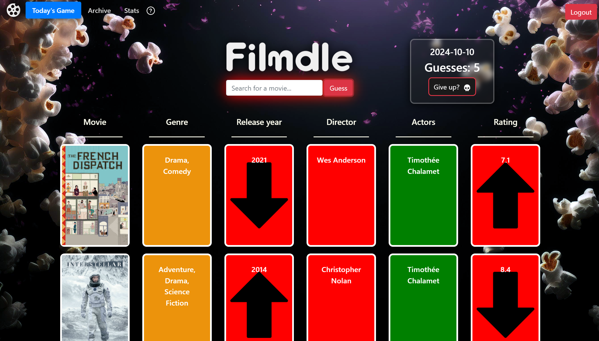

# FILMDLE

You can play the game at: [https://oskarandre.github.io/filmdle.github.io/](https://oskarandre.github.io/filmdle.github.io/)



## How to Play

1. Log in or sign up using your Firebase account.
2. Each day, a new secret movie is selected for you to guess.
3. Use the search function to find movies and make your guess.
4. Receive feedback with color-coordinated clues based on actors, director, release year, genres and rating.

### Feedback Colors

- **Red**: No similarities.
- **Yellow**: One or more correct.
- **Green**: Fully correct.

5. You can leave the game and come back later or give up if needed.
6. Play older previous games in Archive.
8. Check your stats to see your progress and performance.

## About

We have created a game similiar to Wordle where the user can daily guess the correct movie.
The tools we used are Firebase, express, node and React, or FERN for short.

The project includes the following functions:
- User handling with login and signup using Firebase.
- API calls to the Movie Database for the user to search for a movie and also suggestion based on popularity.
- Movies with corresponding dates stored in Firebase for direct access.
- Directly updated user stats and guesses from the React web application to Firebase.
- Archive which makes it possible to play games from days before, with colors corresponding to game state (Finished, Started and Gave Up).
- Stats where the user can view their accumulated results such as games played, wins, average guesses etc.
- Feedback in the game in form of color coordinated clues by comparing all actors within the correct movie and the guessed movie.
- Hoverable names of actors and directors to view an image of the person.
- The ability to leave games to finish later or even give up if needed.

## Installation

To install dependencies, run the following commands:
```bash
npm install
```
```bash
npm i vite
```
```bash
npm i canvas-confetti
```


